# Building a Chatbot with Pytorch
---
Hello World. Ever thought how Alexa, Siri or Google voice assistant worked? Think no more. We will be building an entire chatbot that can actually understand what are you trying to say. You do need a basic knowledge of Python, Pytorch and a little bit of other things. Lets get Started. Keep in mind that this is a very basic Neural Network thatr will get you started with NLP .

Before Proceeding, Here is a list of Requirements for the tutorial. There are tons of Tutorials available online where you can learn these things.

## Requirements:
- Python 3
- Dictionaries & Lists
- Numpy
- Pandas
- Pytorch
- Natural Language Processing (Bag of Words)
## Software Used:
-	Google Colab (You can use any other software that supports Jupyter Notebooks)
-	Google Drive ( You can use your local machine or github as well)
### Read this if you are using google collab with drive:
You need to do little tweaks if you want to access files or datasets that are stored in your drive. 
1. you need to install a library called PyDrive (installation method Is in the notebook)
2. Paste your dataset or file in the colab notebooks folder in drive. 
3. right click on it and click on get link
4. paste the link anywhere (preferrabally in notepad) & extract the file ID
5. the file ID can be obtained from the link. The file ID is alphanumeric characters between /d/ and /view?usp=sharing
6. Paste File ID here  
7. You can replace the intents.json filename to whatever you want

## Introduction
---

___What exactly is a chatbot?___

    A chatbot is an artificial intelligence (AI) software that can simulate a conversation (or a chat) with a user in natural language through messaging applications, websites, mobile apps or through the telephone.
___Why are chatbots important?___ 

 A chatbot is often described as one of the most advanced and promising expressions of interaction between humans and machines. However, from a technological point of view, a chatbot only represents the natural evolution of a Question Answering system leveraging Natural Language Processing (NLP). Formulating responses to questions in natural language is one of the most typical Examples of Natural Language Processing applied in various enterprises’ end-use applications.
A chatbot usually considered as a first step towards your NLP Career. It opens endless opportunity of research and commercial projects which are not only fun to do but also not so difficult to implement

Everything is explained in the Notebook 

We will make a custom function for everything that is used so that we can reuse the function in any other project later. 
## Getting Ready
---
As you might be familiar with the fact that computers are good at performing calculations at numbers, not some random form of data. As there is a famous saying in ML that “Garbage In, Garbage Out”. The quality of your data will define how good or bad your Machine Learning Model will perform. So we have to clean or pre-process our data before we move on to build our model. 

    Preprocessing in NLP is quite different from traditional Machine Learning or Deep Learning. 

### Importing Libraries:
We will first import the relevant libraries. Some of the most important libraries that have been used here are as below

 
### Creating Custom Functions:
We will create custom Functions so that it is easy for us to implement afterwards
 
 

Nltk or natural language took kit is a really useful library that contains important classes that will be useful in any of your NLP task. 

### Stemming

If we have 3 words like “walk”, “walked”, “walking”, these might seem different words but they generally have the same meaning and also have the same base form; “walk”. So, in order for our model to understand all different form of the same words we need to train our model with that form. This is called Stemming. There are different methods that we can use for stemming. Here we will use Porter Stemmer model form our NLTK Library. 

### Bag of Words:
	
We will be splitting each word in the sentences and adding it to an array.
We will be using bag of words. Which will initially be a list of zeros with the size equal to the length of the all words array.
 
If we have a array of ` sentences = ["hello", "how", "are", "you"]` 
and an array of total ` words = ["hi", "hello", "I", "you", "bye", "thank", "cool"]` then its bag of words array will be `bog  = [  0 ,    1 ,    0 ,   1 ,    0 ,    0 ,      0]`. 

We will loop over the each word in the all words array and the bog array corresponding to each word. If a word from the sentence is found in the all words array, 1 will be replaced at that index/postion in bog array.

During the the process , we will also use ***nltk.word_tokenize()*** which will convert a single sentence string into a list of word. E.g if you pass `"hello how are you"`, it will return `["hello", "how", "are", "you"]`. 

**Note:**
    we will pass lower case words to the stemmer so that words like Good and good  (capitalized)  won’t be labelled as different words.

### Loading the Data & Cleaning it

We will be using a data set called ***intents.json*** which has the following structure.

 

Seems familiar? If you noticed , this looks similar to nested dictionary in python. That’s how **JSON** is formatted. 
Now we will simply load the json file using ***json.load()*** function.

 

In order to get the right information, we will be unpacking it with the following code. 

 

This will separate all the tags & words into their separate lists

### Implementing custom Functions

 
 
### Creating Training Data: 
We will transform the data into a format that our PyTorch Model can Easily Understand
 
 
    One hot encoding Is the process of splitting multiclass or multi valued data column to separate columns and labelling the cell 1 in the row where it exists. (we won’t use it so don’t worry about it)

## PyTorch Model
---
Here we will be making a class to implement our custom neural network. It will be a feed forward neural Network which will have 3 Linear Layers and we will be using activation function “ReLU” . 

    Note: 
    We have used the super() function to inherit the properties of its parent class. 
    This is an Object Oriented Programming (OOP) concept.

### Feed Forward Neural Network

`A feedforward neural network is an artificial neural network wherein connections between the nodes do not form a cycle. As such, it is different from its descendant: recurrent neural networks.`

The feedforward neural network was the first and simplest type of artificial neural network devised In this network, the information moves in only one direction—forward—from the input nodes, through the hidden nodes (if any) and to the output nodes. There are no cycles or loops in the network [1] 

#### Activation Function:
`
An activation function is a function used in artificial neural networks which outputs a small value for small inputs, and a larger value if its inputs exceed a threshold. If the inputs are large enough, the activation function "fires", otherwise it does nothing. In other words, an activation function is like a gate that checks that an incoming value is greater than a critical number. [2]`

Activation functions are useful because they add non-linearities into neural networks, allowing the neural networks to learn powerful operations. If the activation functions were to be removed from a feedforward neural network, the entire network could be re-factored to a simple linear operation or matrix transformation on its input, and it would no longer be capable of performing complex tasks such as image recognition.

### ReLU Function:
There are a number of widely used activation functions in deep learning today. One of the simplest is the rectified linear unit, or ReLU function, which is a piecewise linear function that outputs zero if its input is negative, and directly outputs the input otherwise:

 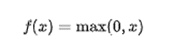
 
Mathematical definition of the ReLU Function

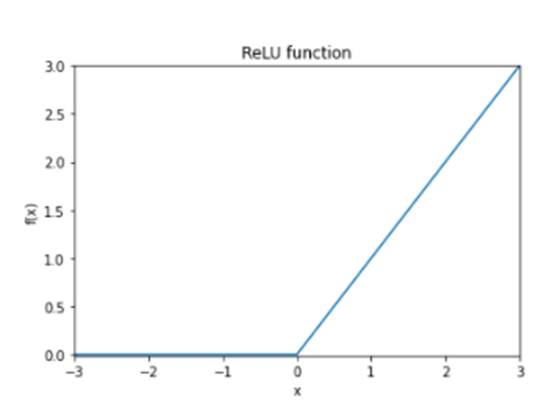
 
Graph of the ReLU function, showing its flat gradient for negative x. [2]

#### ReLU Function Derivative:

It is also instructive to calculate the gradient of the ReLU function, which is mathematically undefined at x = 0 but which is still extremely useful in neural networks.

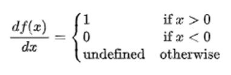
 
The derivative of the ReLU function. In practice the derivative at x = 0 can be set to either 0 or 1. 
The zero derivative for negative x can give rise to problems when training a neural network, since a neuron can become 'trapped' in the zero region and backpropagation will never change its weights. [2] 

## Creating our Model
---

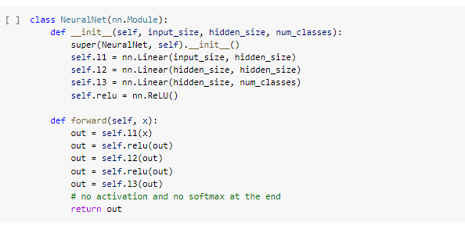

###	Assigning the Dataset to the Model:
We will use some Magic functions, write our class.

You can read online about `__getitem__` and `__getitem__` magic funtions. 

 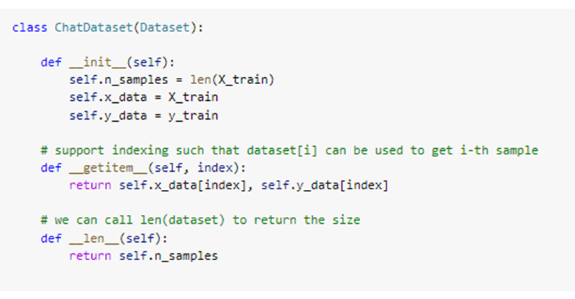

###	Hyper Parameters:
Every Neural network has a set of hyper parameters that need to be set before use. 

Before Instantiating our Neural Net Class or Model that we wrote earlier, we will first define some hyper parameters which can be changed accordingly. 

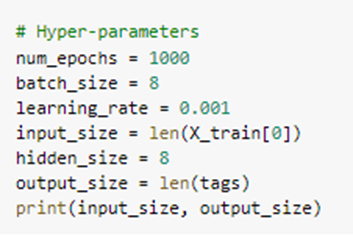
 
###	Loss and optimizer: 
We will now Instantiate the model, loss and optimizer functions.

    Loss Function: Cross Entropy 
    Optimizer: Adam Optimizer
 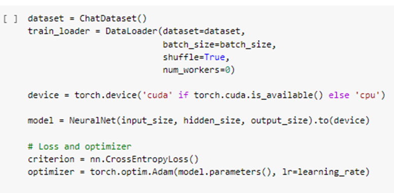

### Training the Model
---

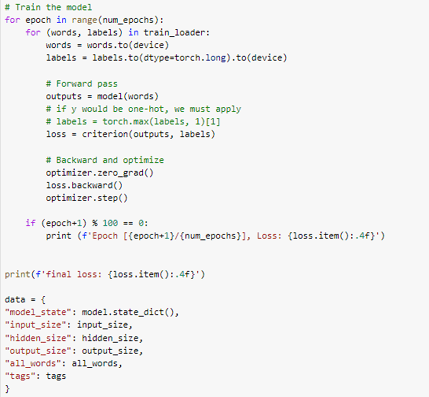

###	Saving the Trained Model
---
 
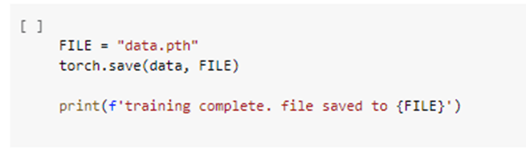

### Loading our Saved Model
---

 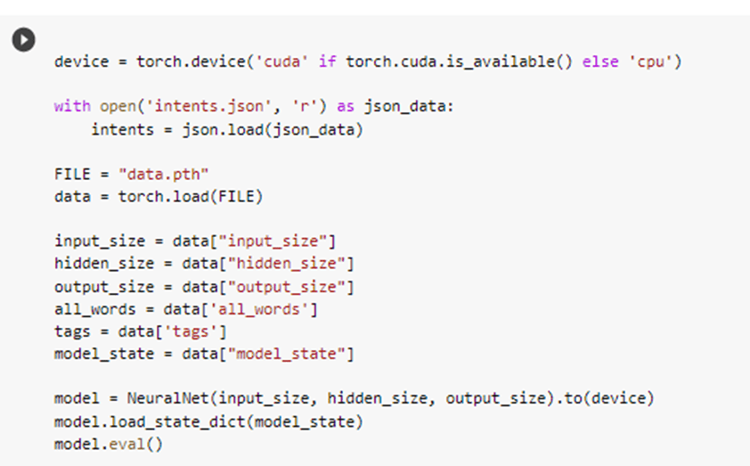
 
## Using the Chatbot:
---
Our Model is Ready. Now we will finally chat with our chat-bot. As our training data was very limited, we can only chat about a handful of topics. You can train it on a bigger dataset to increase the chatbot’s generalization / knowledge.
 
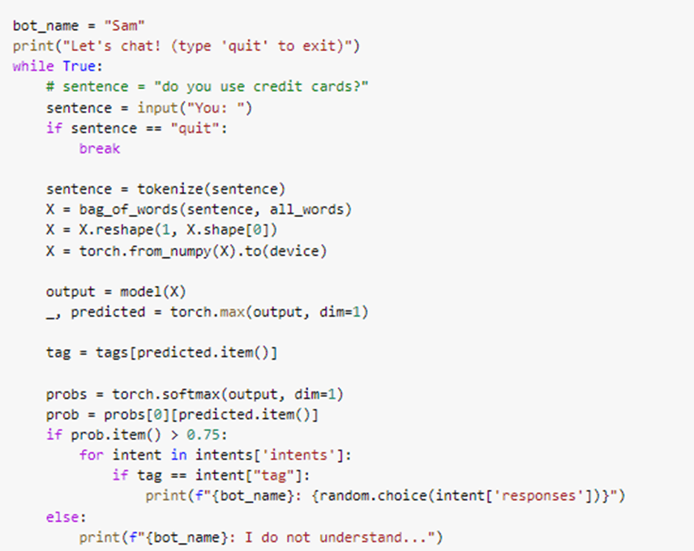

## Chatting with our Chatbot
---
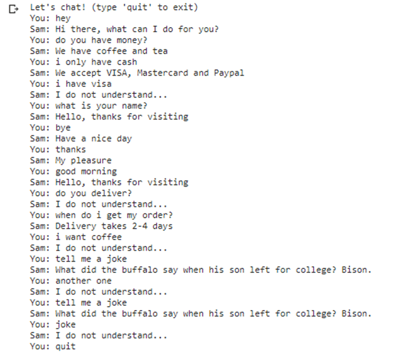

`Our Model has been trained with very few examples, so it does not understand everything. It is a great start for new learners. Just train this exact model on a bigger dataset & Voila, You'll see the charm .`

 

# Bibliography
---

**[1]** 	Wikipedia, "FeedForward Neural Network," Wikipedia, [Online]. Available: https://en.wikipedia.org/wiki/Feedforward_neural_network.

**[2]** 	T. Wood, "Activation Function," DeepAI, [Online]. Available: https://deepai.org/machine-learning-glossary-and-terms/activation-function.

